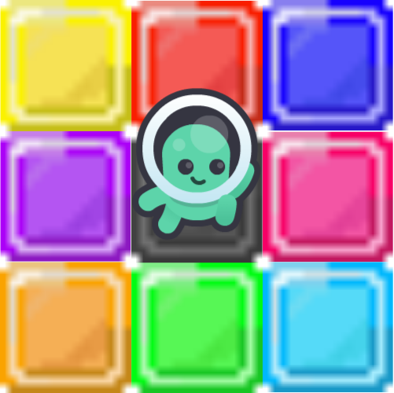

<div align="center">
  
</div>

<div align="center">
    <h1>KalMag Mixer 🎵🟨🟥🟦🟪🟩🟧🟪</h1>
    <h3>A musical puzzle platformer with synchronized mixer loops, color-coded stages, and interactive sound!</h3>
</div>


---
## 🟨🟥🟦🟪🟩🟧🟪 **What is KalMag Mixer?**

**KalMag Mixer** is a Unity-based musical puzzle platformer featuring:
- **Looping mixer tracks** (each stage/loop unlocks a new sound channel)
- **Colorful visual cues** and obstacles tied to the music loops
- Platforming mechanics, evolving challenges, and real-time *mixer buttons* to mute/unmute channels
- Original music and hand-crafted pixel art

Your goal: reach the exit by listening, timing, and manipulating both the level and the soundtrack!

---

## 🚀 Getting Started

### Prerequisites

- **Unity Editor** (2022.3.29f1 or later recommended)
- **Visual Studio** or another C#-compatible IDE

### Installation

1. **Clone the Repository**
   ```bash
   git clone https://github.com/DotanVG/KalMagMixer.git
   ```
2. **Open the Project**
   - Open Unity Hub, click "Add", and select the project folder.
   - Open in Unity.

3. **Run the Game**
   - Open `Assets/Scenes/MainMazeScene.unity`
   - Click **Play** to launch the game in the editor.

---

## 🎮 Controls

- **Arrow Keys** – Move left/right
- **Spacebar** – Jump
- **1–8** – Mute/unmute available mixer tracks (as you unlock new loops)
- **R** – Respawn to the starting point if stuck

---

## 🛠️ Built With

- 
- 

---

## 🎨 **Credits**

Game Design & Development: [Dotan Veretzky](https://www.linkedin.com/in/dotan-v/)  
Original Soundtrack & Sound Design: [Itai Oren](https://www.linkedin.com/in/itayoqa/)  
Original Art & Sprites: [Mor Yosef](https://www.linkedin.com/in/mor-yosef-185331196/)  
Kenney - [2D Platformer Pack](https://kenney.nl/assets/platformer-pack) (sprites & SFX)

<div align="center">
    <a href="https://kenney.nl"></a>
</div>

---

## 🌍 Play Now

- **[Play on itch.io](https://dotanv.itch.io/kalmagmixer)**
- **[View on GitHub](https://github.com/DotanVG/KalMagMixer)**

Feedback and contributions are welcome!

---

<p align="center">
  <b>Enjoy the rhythm. Master the loop. Break out of the maze!</b>
</p>
